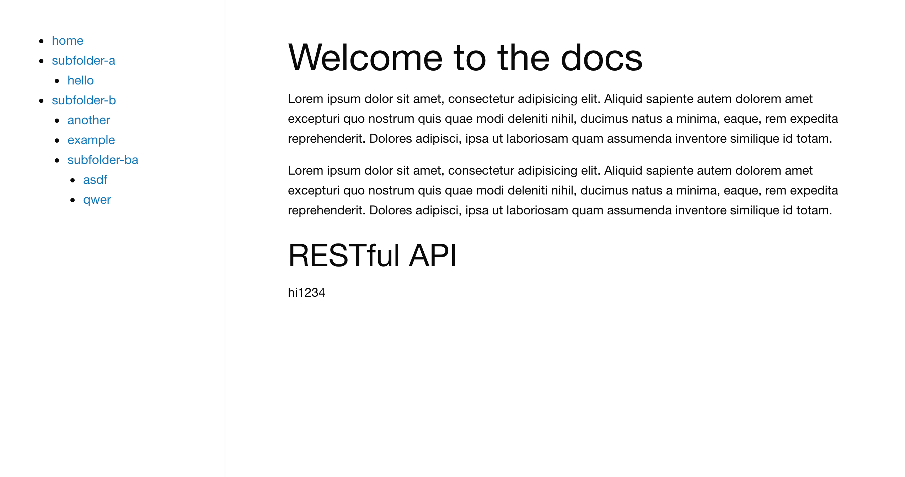

# Simple Markdown Server

**Version**: 0.1.0

Given a directory, `sample`, which looks like this:

```plaintext
sample
├── index.md
├── subfolder-a
│   ├── hello.md
│   └── index.md
└── subfolder-b
    ├── another.md
    ├── example.md
    ├── index.md
    └── subfolder-ba
        ├── asdf.md
        ├── index.md
        └── qwer.md
```

You can run a webserver which shows this contents with this `mdserver` CLI:

```
mdserver --directory sample/ --port 3000
# or
md server -d sample/ -p 3000
```

Navigate to the port you specify and you'll see a page which looks like this:


